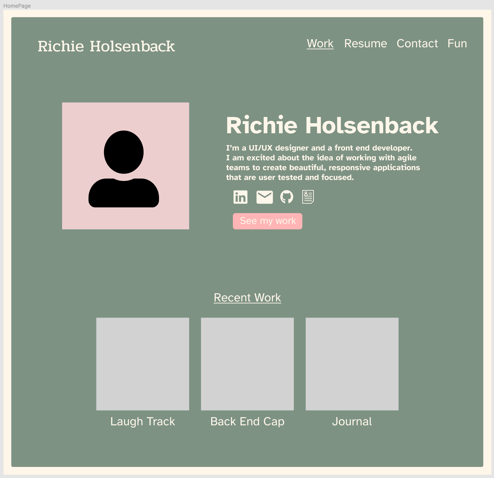
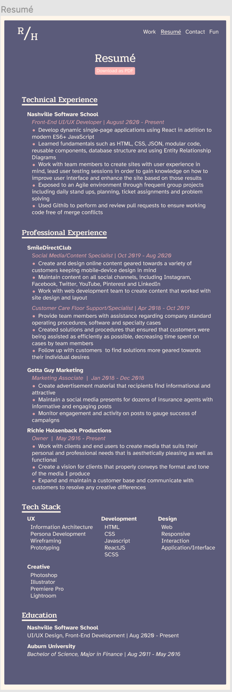
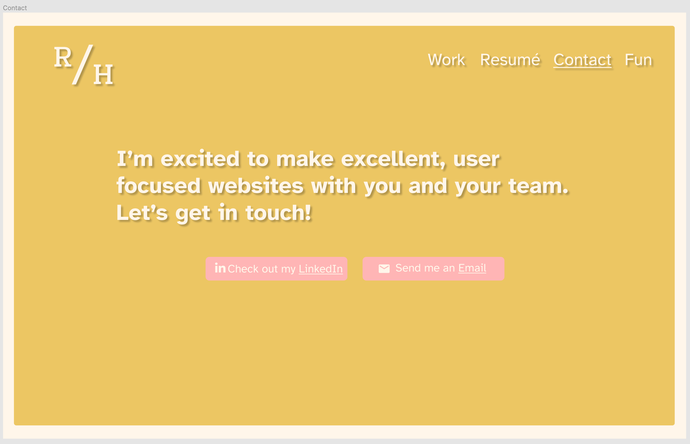
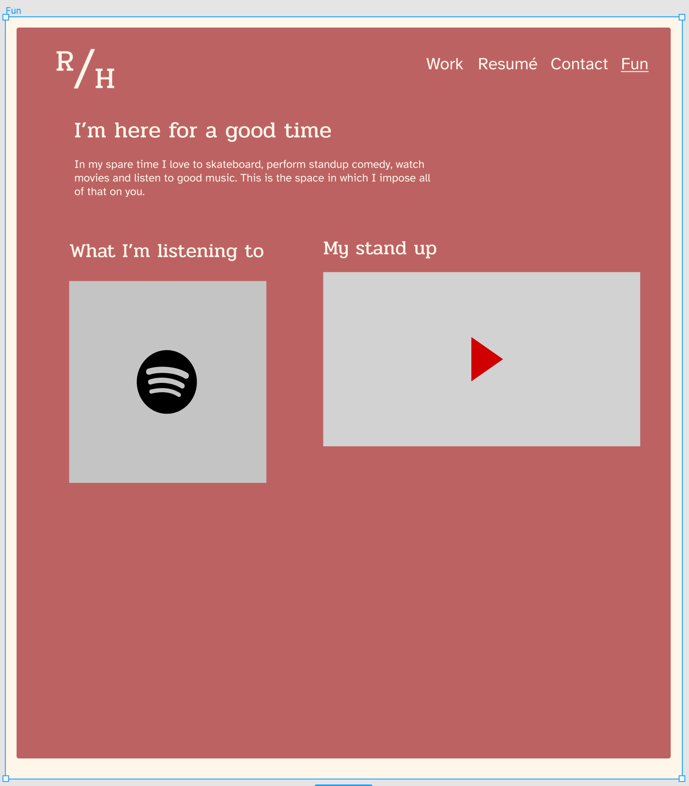

# My Portfolio

This project was bootstrapped with [Create React App](https://github.com/facebook/create-react-app).

## The Idea

I loved going over to my grandparents house and finding the tons of old magazines they had tucked away in closets. They'd be about hunting and fishing, celebrity gossip, current affairs and everything in between. I've never been much of a huntsman, fisherman, celebrity gossiper and, as a child, certainly did not care about the speculation surrounding Reagan, but I was always enamored by the styles of the advertisements. They hadn't all aged gracefully but everything looked so beautiful, still. I loved the faded colors, the creamy whites and the illustrations. How they conveyed the idea of the perfect life many years ago. It felt so classy yet simplistic. I never bought any cigarettes that could help to "improve my overall health" or giant hairdryers like you'd see in the movies, but the styles and motifs of those ad designs stuck like glue.

I want my portfolio to mimic a similar style. The rounded corners, the serifed fonts, the faded colors. I find it all gorgeous.

## Viewing my Portfolio

You can visit a live version of my portfolio at www.RichieHolsenback.com. If you'd like to view the code and run it on your own machine, follow these steps.

* Download the repository from [GitHub](https://github.com/richieholsenback/web-portfolio)
* Go into the command line and run
    * ```npm install ```
    * ```npm start```
* You will see a localhost URL, copy and paste this into your browser if it does not pull up on it's own
* Explore!

## The Creation

I looked through a lot of templates to try to piece together what I thought to be the most effective way to communicate my skills in a way that I thought showcased who I am as a person, a creative and a developer. 

My Mock-Up:




